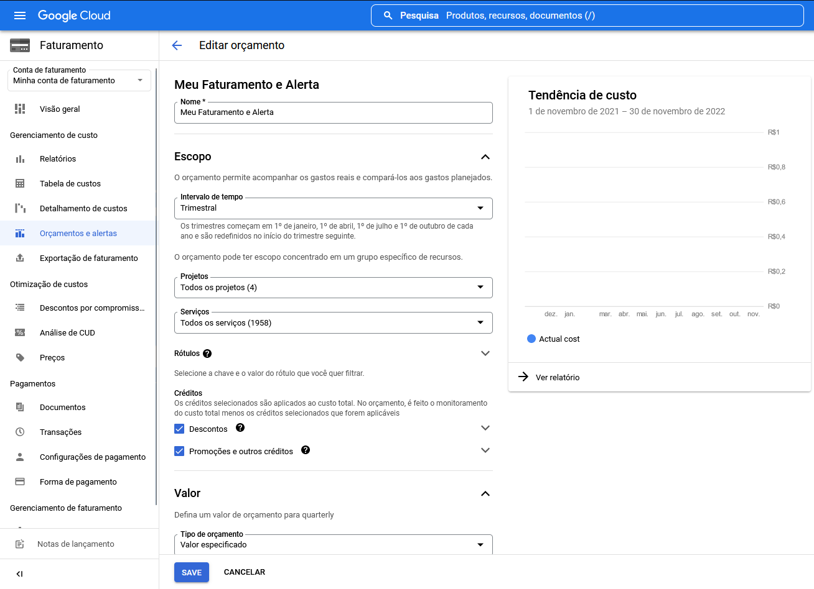
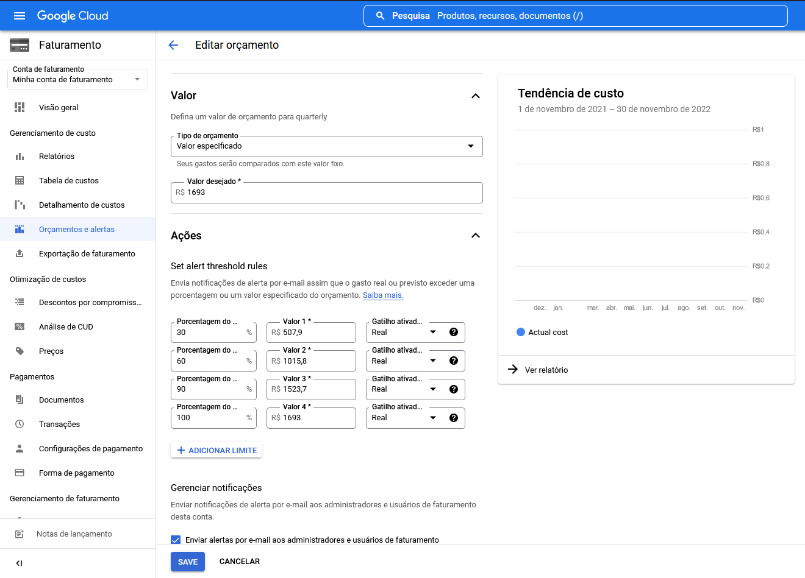

# Orçamento e Alertas de Faturamento no GCP

## Projeto de Faturamento e Alertas de uma organização do GCP

### Passos para definir um orçamento e alertas de faturmento

1. Acessar o console do GCP em [console.cloud.google.com](https://console.cloud.google.com)
2. Acessar a sessão de faturamento clicando no menu lateral direito
3. Acessar a sub sessão orçamento e alertas
4. Preencher os campos conforme o desejado

---

### Definição da minha organização

Foi definido um orçamento geral para todos os projetos e abrangendo todos os serviços para facilitar. Contudo, em uma organização real, o ideal é definir orçamentos por projetos e serviços de acordo com o planejamento da equipe de FinOps.